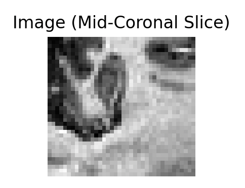
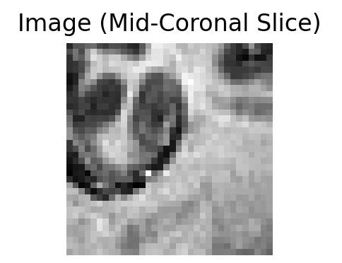
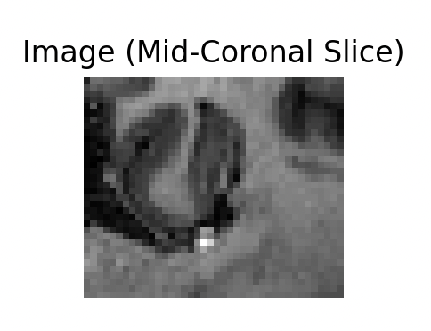
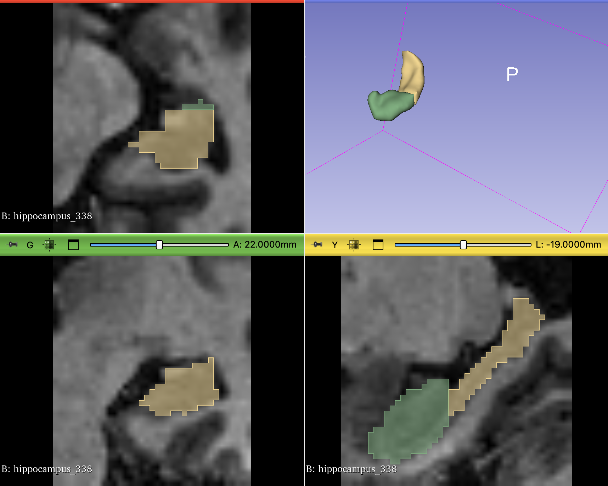

# Hippocampus Segmentation Challenge (Task04_Hippocampus)

## Overview

This project implements a 3D U-Net for hippocampus segmentation from T1-weighted MRI scans. The model segments the hippocampus into anterior (head) and posterior (body + tail) regions, based on the Medical Decathlon challenge dataset.

## Preview

Mid-coronal slices showing hippocampus segmentation results:

<div align="center">
  
  
  
</div>

Sample mask visualization:

<div align="center">
  
</div> 

## Reference

This implementation is based on the following research paper:

**U-Net: Convolutional Networks for Biomedical Image Segmentation**

- **Authors**: Olaf Ronneberger, Philipp Fischer, Thomas Brox
- **Conference**: Medical Image Computing and Computer-Assisted Intervention (MICCAI) 2015
- **DOI**: 10.1007/978-3-319-24574-4_28
- **arXiv**: [1505.04597](https://arxiv.org/abs/1505.04597)

## Model Architecture

### 3D U-Net Implementation

The model implements a 3D variant of the U-Net architecture with the following specifications:

#### Encoder (Downsampling Path)
- **Input**: 3D T1-weighted MRI images (1 channel)
- **Down1**: 1 → 16 channels (DoubleConv3D)
- **Down2**: 16 → 32 channels (DoubleConv3D)
- **Down3**: 32 → 64 channels (DoubleConv3D)
- **Down4**: 64 → 128 channels (DoubleConv3D)
- **Pooling**: 3D MaxPooling with 2×2×2 kernel

#### Decoder (Upsampling Path)
- **Up1**: 128+64 → 64 channels (with skip connection)
- **Up2**: 64+32 → 32 channels (with skip connection)
- **Up3**: 32+16 → 16 channels (with skip connection)
- **Output**: 16 → 3 channels (multi-class segmentation)

#### Segmentation Classes
- **Class 0**: Background
- **Class 1**: Hippocampus anterior (head)
- **Class 2**: Hippocampus posterior (body + tail)

#### Key Components
- **DoubleConv3D**: Two consecutive 3D convolutions with BatchNorm and ReLU
- **Skip Connections**: Concatenation of encoder features with decoder features
- **Upsampling**: Trilinear interpolation with scale factor 2
- **Padding**: Dynamic padding to handle size mismatches in skip connections

### Model Parameters

| Parameter | Value |
|-----------|-------|
| Input Channels | 1 |
| Output Channels | 3 (multi-class) |
| Initial Learning Rate | 0.001 |
| Optimizer | Adam |
| Loss Function | CrossEntropyLoss |
| Batch Size | 1 (due to 3D volume size) |
| Early Stopping Patience | 10 epochs |

## Dataset

260 T1-weighted MRI scans from Vanderbilt University Medical Center. Split 7:2:1 for training/validation/testing.

```
hippo/
├── train_img/     # Training images (.nii.gz)
├── train_mask/    # Training masks (.nii.gz)
├── val_img/       # Validation images (.nii.gz)
├── val_mask/      # Validation masks (.nii.gz)
├── test_img/      # Test images (.nii.gz)
└── test_mask/     # Test masks (.nii.gz)
```

**Imaging details:**
- 3D T1-weighted MPRAGE
- 170 sagittal slices
- 1.0 mm³ voxel size
- Philips Achieva scanner


## Training

- Loads NIfTI files using `nibabel`
- Converts to PyTorch tensors
- Early stopping after 10 epochs without improvement
- Saves best model based on validation loss
- Auto-detects GPU/CPU


## Evaluation Metrics

The model is evaluated using the DSC metric:

### Dice Score
- **Formula**: Dice = (2 × Intersection) / (Sum of Predictions + Sum of Ground Truth)
- **Range**: 0 to 1 (higher is better)
- **Implementation**: Per-class dice scores for multi-class segmentation

## Results

Based on the provided results, the model achieved the following performance metrics:

### Dice Scores (Percentiles: 25th, 50th, 75th)

**Class 0 (Background):**
- 25th percentile: 0.994
- 50th percentile: 0.994  
- 75th percentile: 0.995

**Class 1 (Hippocampus Anterior - Head):**
- 25th percentile: 0.863
- 50th percentile: 0.891
- 75th percentile: 0.901

**Class 2 (Hippocampus Posterior - Body + Tail):**
- 25th percentile: 0.843
- 50th percentile: 0.857
- 75th percentile: 0.881


The posterior hippocampus scores slightly lower, likely due to its smaller size and more complex shape.

## Usage

### Training
```bash
python main.py
```

### Testing
```bash
python test.py
```

### Requirements
```
torch
nibabel
numpy
scipy
matplotlib
opencv-python
```

## Model Files

The trained models are saved with timestamps in the `models/` directory.
